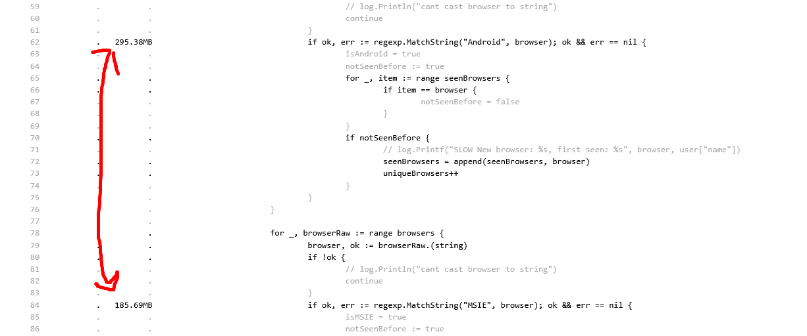
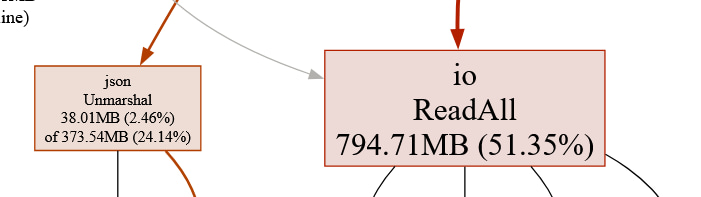
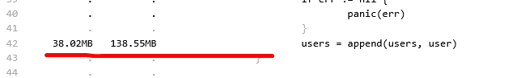
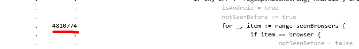
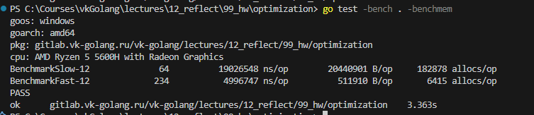

# Отчет 
-
1. Сразу бросается в глаза регекс, по примеру с пары всю работу с ними перевожу в работу со строками. Использовал strings.contains

2. Делаю буфер для строки по примеру с лекции вместо конкатенации строк.

3. Мы подгружаем сразу весь файл - это проблема; для работы с большими данными, чтобы не держать их в памяти, воспользовался примером декодера. Он же сразу под капотом имел и анмаршал, что помогло решить проблему. Также завел стракт со всеми нужными данными, чтобы не занимать память тем, что нам не нужно + type assertion`ы требуют ресурсов. p.s сначала пробовал со сканнером, но он все еще много памяти ел, вариант с декодером был лучше всего

4. Добавил пул для переиспользования объектов, убрав перед этим в целом использование слайса юзеров и какое-либо накопление в памяти

5. Заменил слайс seenBrowsers на мапу, потому что логике это не мешало никак, а вот seenBefore теперь делается на O(1) вместо O(n).

6. Объединил 2 цикла в 1, потому что незачем делать 2 цикла и больше аллокаций делать для одних и тех же действий
---
# Отрабатывает следующим образом (проходит по параметрам решения):
 
Можно, наверное, улучшить strings.ReplaceAll, но не знаю, как сделать это наиболее лаконично и правильно. Ну и да - я решил обойтись без easyjson
